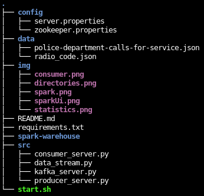
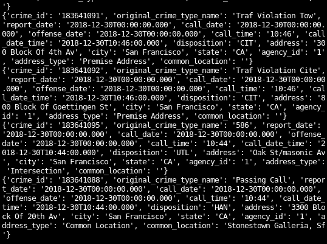
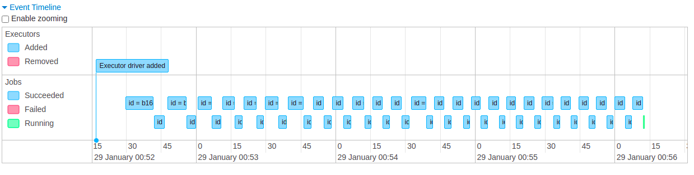
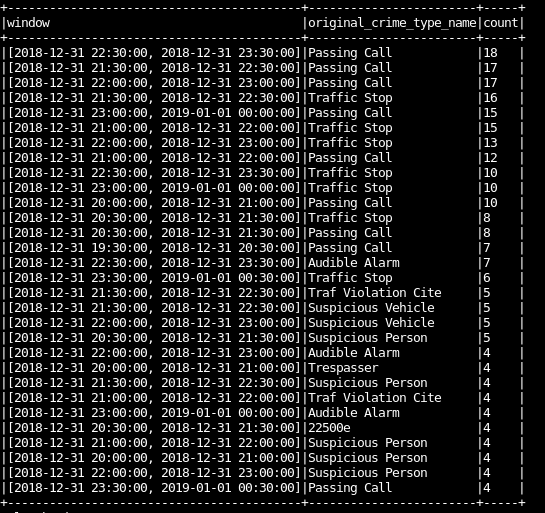

# SF Crime Statistics with Spark Streaming

## About Project

In this project, throughtout a real-world dataset, extracted from Kaggle, on San Francisco crime incidents, will be possible provide statistical analyses of the data using Apache Spark Structured Streaming. The goal is create a Kafka server to produce data, and ingest data throught Spark Structured Streaming.

## How run the project

#### Directories

The project have to start zookeeper and producer server. To do this, run the command in different terminal:

`
/usr/bin/zookeeper-server-start ./config/zookeeper.properties
/usr/bin/kafka-server-start ./config/server.properties
`

To install requiriments use the commnad every time when re-open the workspace:

`
./start.sh
`

Run kafka_server.py and producer_server.py to send data from police-department-calls-for-service.json into kafka topic

`python ./src/kafka_server.py
python ./src/producer_server.py
`

Run the consumer command to show the data being consumed from kafka topic like image below:

`python ./src/consumer_server.py`

or

`kafka-console-consumer --bootstrap-server localhost:9092 --topic com.udacity.police-calls --from-beginning`

Then, spark-submit and you will see:

`
spark-submit --packages org.apache.spark:spark-sql-kafka-0-10_2.11:2.3.4 --master local[*] ./src/data_stream.py
`
### SparkUI

### Statistics

## How did changing values on the SparkSession property parameters affect the throughput and latency of the data?
Changing the values from `numInputRows`, `inputRowsPerSecond` and `processedRowsPerSecond` can be possible view how much data was being processed and its difference.

## What were the 2-3 most efficient SparkSession property key/value pairs? Through testing multiple variations on values, how can you tell these were the most optimal?

"spark.streaming.kafka.maxRatePerPartition":10, 
"spark.sql.shuffle.partitions": 2, 
"spark.default.parallelism":1200